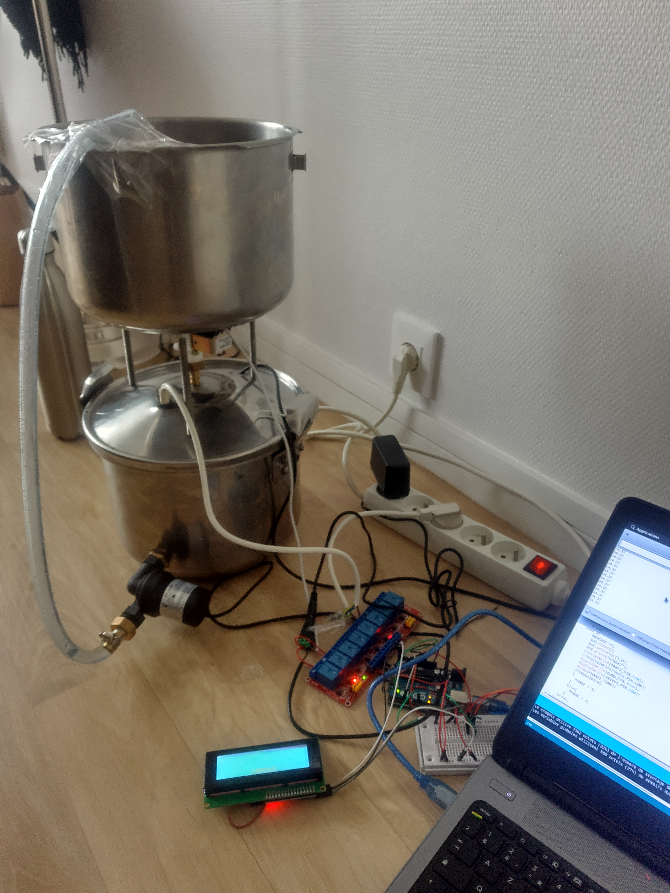

# Mini_Auto_Brew
Homebrew automation system with Arduino

J'ai changé le tuyau depuis ainsi que le couvercle, ne vous inquiétez pas pour la santé de mes convives.

La marmite du dessus contient la "chaussette" avec le malt. Elle est percée pour mettre l'électrovanne ainsi que les 3 pieds.

La marmite du dessous permets de chauffer le moût avec une résistance de 350W (de mémoire). La pompe permets de créer le courant.

Le code est simple :

- Chauffez l'eau, si l'eau est à ... (50° par exemple) activez la pompe.
- Maintenir 5 min le mout dans la marmite du haut
- Vider la marmite du haut pour réchauffer.

On a une boucle avec autant de paliers désirés puis on fait bouillir.

Ça bip, ajout du premier houblon, ça bip second houblon. (Il manquerait une petite trappe pour mettre la "chaussette" de houblon)

Un fois fini, on enlève le tuyau du haut et on passe dans le refroidisseur à plaques.

Coût (Emmaus beaucoup):  

- 2 marmites alu/inox : 8€ les deux
- résistance : 2€
- pompe : 10€ ~
- Électrovanne : 4€ ~
- Le reste j'avais déjà

Perçage des trous de 20cm dans de l'inox ---> Aller voir un carrossier.
